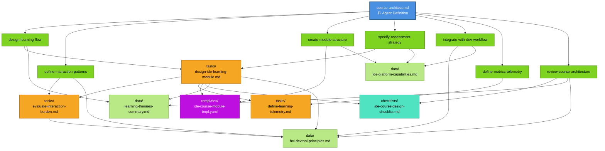
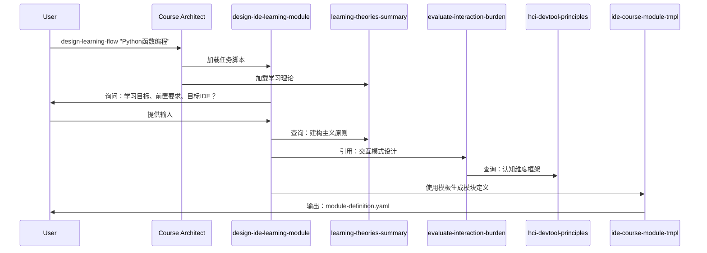
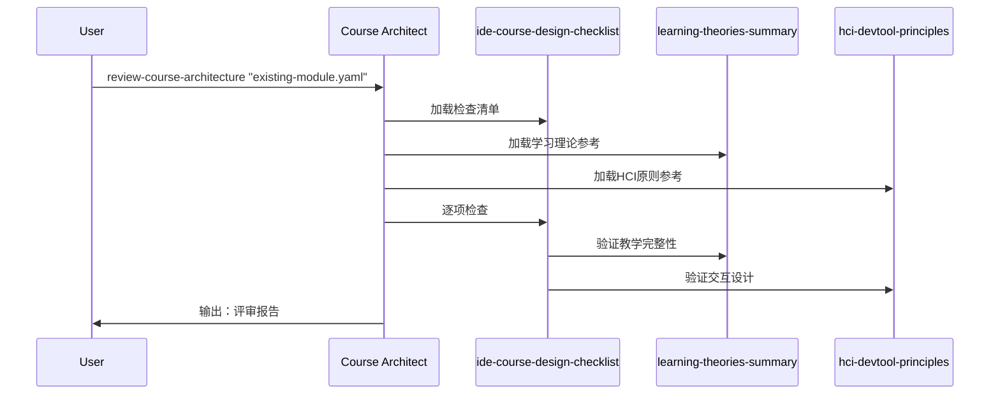

# 依赖关系图

<!-- Powered by BMAD™ Core -->

> **文档定位**: 技术架构文档 - 详细描述 Agent 的依赖关系、加载机制和引用规范。
> 
> **快速开始**: 见 [QUICK-START.md](QUICK-START.md) | **概述**: 见 [README.md](README.md)

## 完整依赖关系可视化



## Commands → Dependencies 映射表

| 命令 | Tasks | Templates | Checklists | Data |
|------|-------|-----------|------------|------|
| `design-learning-flow` | design-ide-learning-module | - | - | learning-theories-summary |
| `define-interaction-patterns` | evaluate-interaction-burden | - | - | hci-devtool-principles |
| `create-module-structure` | - | ide-course-module-tmpl | - | ide-platform-capabilities |
| `specify-practice-strategy` | design-ide-learning-module | - | - | ide-platform-capabilities |
| `integrate-with-dev-workflow` | - | - | - | hci-devtool-principles, ide-platform-capabilities |
| `define-content-feedback` | define-content-feedback | - | - | - |
| `review-course-architecture` | - | - | ide-course-design-checklist | learning-theories-summary, hci-devtool-principles |

## Tasks 内部依赖链

### design-ide-learning-module
→ evaluate-interaction-burden → hci-devtool-principles  
→ define-content-feedback  
→ ide-course-module-tmpl  
→ ide-course-design-checklist  
→ learning-theories-summary  

### evaluate-interaction-burden
→ hci-devtool-principles

### define-content-feedback
(无外部依赖)

## 命令执行流程示例

### 示例 1: 设计新的学习流程



### 示例 2: 评审现有架构



## 依赖加载规则

基于 **B-MAD 按需加载规则**，依赖文件仅在以下情况加载：

### 1. 自动加载
执行命令时，Agent 自动加载该命令定义的依赖：

```yaml
# 示例：执行 define-interaction-patterns 命令
- define-interaction-patterns {module_id}:
    uses_tasks: [evaluate-interaction-burden]  # 自动加载
    uses_data: [hci-devtool-principles]        # 自动加载
```

### 2. 显式加载
用户明确请求时加载：

```
请使用 learning-theories-summary 数据文件中的建构主义理论
```

### 3. 级联加载
任务内部引用的依赖会递归加载：

```
T1 (design-ide-learning-module)
  → T2 (evaluate-interaction-burden)
      → D2 (hci-devtool-principles)
```

## 文件类型与职责

| 类型 | 图标 | 职责 | 命名规范 |
|-----|------|------|---------|
| **Agent Definition** | 🏗️ | 定义身份、命令和依赖 | `{agent-id}.md` |
| **Tasks** | 📋 | 可执行工作流程脚本 | `{action}-{object}.md` |
| **Templates** | 📄 | 结构化输出格式模板 | `{output-type}-tmpl.yaml` |
| **Checklists** | ✅ | 质量保证检查清单 | `{scope}-checklist.md` |
| **Data** | 📚 | 知识库参考资料 | `{topic}-summary.md` |

## 引用语法规范

### 在 Markdown 文件中引用

```markdown
# 方式 1: 相对路径（推荐用于明确引用）
参考：data/learning-theories-summary.md
使用任务：tasks/evaluate-interaction-burden.md
使用模板：templates/ide-course-module-tmpl.yaml

# 方式 2: 短名称（推荐用于叙述中）
[cite: learning-theories-summary]
[cite: Task - evaluate-interaction-burden]
[cite: Template - ide-course-module-tmpl]
```

### 在 YAML 配置中引用

```yaml
# 在 commands 中定义依赖
- command-name {params}:
    description: "命令描述"
    uses_tasks: [task-name]
    uses_templates: [template-name]
    uses_checklists: [checklist-name]
    uses_data: [data-name]

# 在 dependencies 中定义路径
dependencies:
  base_path: ./
  tasks:
    - name: task-name
      path: tasks/task-name.md
      purpose: "任务说明"
```

## 验证依赖完整性

### 运行验证脚本

```bash
cd agents/course-architect
./validate-dependencies.sh
```

### 验证内容

- ✅ 核心文件存在性
- ✅ Task/Template/Checklist/Data 文件存在性
- ✅ 交叉引用完整性
- ✅ YAML 结构完整性
- ✅ BMAD™ Core 标记

### 预期输出

```
🔍 Validating IDE Course Architect Dependencies...
✓ All checks passed!
The agent dependency structure is valid and complete.
```

## 扩展依赖时的检查清单

添加新依赖时，请完成以下步骤：

- [ ] 创建文件并添加 `<!-- Powered by BMAD™ Core -->` 标记
- [ ] 在 `course-architect.md` 的 `dependencies` 部分注册
- [ ] 在相关命令的 `uses_*` 字段中引用
- [ ] 更新本依赖关系图
- [ ] 运行 `validate-dependencies.sh` 验证
- [ ] 如需要，更新 `README.md` 中的说明

## 依赖统计

- **Agent 定义**: 1 个
- **Tasks**: 3 个
- **Templates**: 1 个
- **Checklists**: 1 个
- **Data**: 3 个
- **文档**: 4 个
- **工具**: 1 个验证脚本

**总计**: 13 个文件 | **验证状态**: ✅ 已验证

---

**更新日期**: 2025-10-29  
**相关文档**: [README](README.md) | [快速开始](QUICK-START.md)
